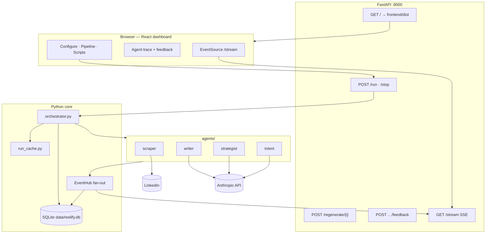
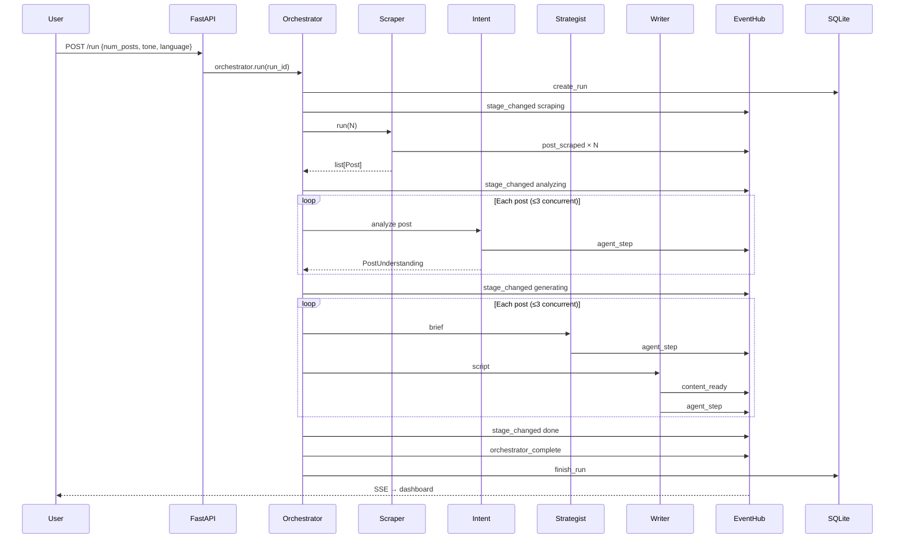

# Reelify — LinkedIn saved posts → Instagram Reels scripts

Reelify is a local-first agentic pipeline that scrapes your **LinkedIn saved posts**, understands each post’s intent, plans a short-form angle, and writes **Instagram Reels scripts** (hook, spoken script, caption, hashtags, CTA). A live React dashboard shows pipeline progress, cinematic visuals, per-agent traces, and lets you edit, copy, export, or regenerate individual scripts.

---

## Current state (what ships today)

| Area | Status |
|---|---|
| **Scrape** | Playwright (headed Chromium), text + media type / image URLs |
| **Intent agent** | Claude Haiku — `PostUnderstanding` from text + media metadata |
| **Strategist agent** | Claude Haiku — `ContentBrief` (angle, hook direction, beats) |
| **Writer agent** | Claude Sonnet — final `ReelsScript` with engagement-focused prompts |
| **Languages** | English, Gujarati (ગુજરાતી), Hindi (हिन्दी) |
| **Observability** | `agent_step` SSE events, SQLite persistence, Agent trace UI, 👍/👎 feedback |
| **Script UX** | Inline edit, copy packs, `.md`/`.json` export, single-post regenerate (no re-scrape) |
| **Cost guard** | Per-run budget cap (`REELIFY_MAX_RUN_BUDGET_USD`, default $2) |
| **Vision API** | Not yet — carousel images use metadata-only intent (see [roadmap](docs/AGENTIC_ROADMAP.md)) |
| **Image generation** | Not yet |

---

## Architecture

### System overview



### Agent pipeline (one run)



### Critical architectural decisions

| Decision | Choice | Why |
|---|---|---|
| **Agent model** | Plain Python modules, not LangChain/LangGraph | Small pipeline, explicit stages, easy to test and observe; no open-ended tool loops in v1 |
| **Real-time updates** | SSE (`EventHub` → `/stream`) | Server → client only; simpler than WebSocket, works through proxies, auto-reconnect in browser |
| **Event fan-out** | One bounded `asyncio.Queue` per subscriber | A single queue can’t fan-out; drop oldest on overflow so slow tabs don’t block the pipeline |
| **Scrape vs generate concurrency** | Serial scrape, parallel analyze/write (`Semaphore(3)`) | One Playwright session is stateful; LLM calls are independent and rate-limit friendly at 3-wide |
| **Single active run** | `409` if `/run` while task live | In-memory orchestration stays consistent; cancel via `/stop` |
| **Observable steps** | `agent_step` events + SQLite `run_steps` | Users see reasoning and can give per-step feedback; same events drive the Agent trace UI |
| **Cheap vs quality models** | Haiku (intent, strategist) + Sonnet (writer) | Most posts get 2 cheap calls + 1 quality call; prompt caching on writer system prompt |
| **Run budget** | `RunBudget` in `run_context` | Hard cap per run avoids runaway API spend during development |
| **Regenerate without scrape** | `run_cache` holds last `Post[]` + understandings | `POST /regenerate/{index}` re-runs strategist + writer only |
| **LinkedIn login** | `headless=False` Playwright | User completes 2FA/CAPTCHA in visible Chromium (up to 5 min) |
| **Frontend state** | `useReducer` + Context | One screen, bounded state; comet engine decouples visuals from script arrival |
| **Production static** | Vite build served by FastAPI | Same origin for API + UI — no CORS, one process to deploy |
| **Persistence** | SQLite (`REELIFY_DB_PATH`) | Runs, steps, and feedback survive restarts; no separate DB server for local use |

---

## Tech stack

**Backend:** Python 3, FastAPI, Uvicorn, Playwright, Anthropic SDK, sse-starlette, Pydantic v2, SQLite  

**Frontend:** React 18, TypeScript, Vite, CSS Modules, OKLCH tokens, native `EventSource`

**Models (typical run):**

| Step | Model |
|---|---|
| Intent | `claude-haiku-4-5` |
| Strategist | `claude-haiku-4-5` |
| Writer | `claude-sonnet-4-6` |

---

## Project layout

```
agents/
  scraper.py      # LinkedIn saved posts + media hints
  intent.py       # PostUnderstanding
  strategist.py   # ContentBrief
  content.py      # Writer → ReelsScript
orchestrator.py   # Stages, concurrency, budget
tracing.py        # agent_step → SSE + DB
events.py         # EventHub
db/store.py       # SQLite runs / steps / feedback
providers/llm.py  # Anthropic + cost estimates
run_cache.py      # Last scrape for regenerate
frontend/         # React dashboard
main.py           # API + static mount
data/             # reelify.db (gitignored)
docs/
  AGENTIC_ROADMAP.md   # Vision, images, production plan
```

---

## Setup

```bash
python3 -m venv .venv
source .venv/bin/activate
pip install -r requirements.txt
playwright install chromium
cp .env.example .env   # ANTHROPIC_API_KEY, LINKEDIN_EMAIL, LINKEDIN_PASSWORD

cd frontend && npm install && npm run build && cd ..
python main.py
```

Open **http://localhost:8000**.

**Frontend dev (HMR):** in a second terminal:

```bash
cd frontend && npm run dev
```

Open **http://localhost:5173** — Vite proxies `/run`, `/stop`, `/stream`, and `/regenerate` to `:8000`.

If port 8000 is in use:

```bash
lsof -i :8000
kill <PID>
```

---

## Usage

1. Open the dashboard.
2. Set **post count**, **language** (EN / Gujarati / Hindi), and **tone** (Punchy, Story-led, Analytical, Educational).
3. Click **Run pipeline** — complete LinkedIn login in the Chromium window if prompted.
4. Watch **Transform pipeline** (scrape → analyze → generate) and **Agent trace** (per-step reasoning, cost, duration).
5. Open scripts in the right panel — **edit**, **copy** (Instagram pack / teleprompter), **export** `.md` or `.json`, or **Regenerate** one post without re-scraping.
6. Use 👍 / 👎 on agent steps to record feedback (stored in SQLite).

---

## API (local)

| Method | Path | Description |
|---|---|---|
| `GET` | `/` | Dashboard (built `frontend/dist`) |
| `GET` | `/stream` | SSE event stream |
| `POST` | `/run` | Start pipeline `{ num_posts, tone, language }` → `{ run_id }` |
| `POST` | `/stop` | Cancel active run |
| `POST` | `/regenerate/{post_index}` | Regenerate one script from cached scrape |
| `GET` | `/runs/{run_id}` | Run metadata |
| `GET` | `/runs/{run_id}/steps` | Persisted agent steps |
| `POST` | `/runs/{run_id}/steps/{step_id}/feedback` | `{ rating: "up"\|"down", comment? }` |

---

## Environment variables

| Variable | Required | Default | Purpose |
|---|---|---|---|
| `ANTHROPIC_API_KEY` | Yes | — | Claude API |
| `LINKEDIN_EMAIL` | Yes | — | LinkedIn login |
| `LINKEDIN_PASSWORD` | Yes | — | LinkedIn login |
| `REELIFY_MAX_RUN_BUDGET_USD` | No | `2.0` | Per-run API spend cap |
| `REELIFY_DB_PATH` | No | `data/reelify.db` | SQLite path |
| `REELIFY_FRONTEND_DIST` | No | `frontend/dist` | Static assets root |

---

## Tests

```bash
source .venv/bin/activate
pytest
```

---

## Notes

- LinkedIn scraping is for **personal use** on your own account.
- Headed browser reduces bot friction; selectors may need updates after LinkedIn UI changes (debug artifacts: `linkedin_saved_posts_debug.png`).
- Deeper design notes: [docs/AGENTIC_ROADMAP.md](docs/AGENTIC_ROADMAP.md) (vision models, thumbnails, job queue, production deploy).

---

## Roadmap (summary)

1. **Vision** — Gemini Flash (or similar) for carousel/image understanding  
2. **Media ingest** — download and store post images locally  
3. **Thumbnails** — template + optional image generation  
4. **Background workers** — Redis/ARQ for long runs off the HTTP thread  
5. **Playwright session persistence** — fewer logins  

See [docs/AGENTIC_ROADMAP.md](docs/AGENTIC_ROADMAP.md) for full phasing.
