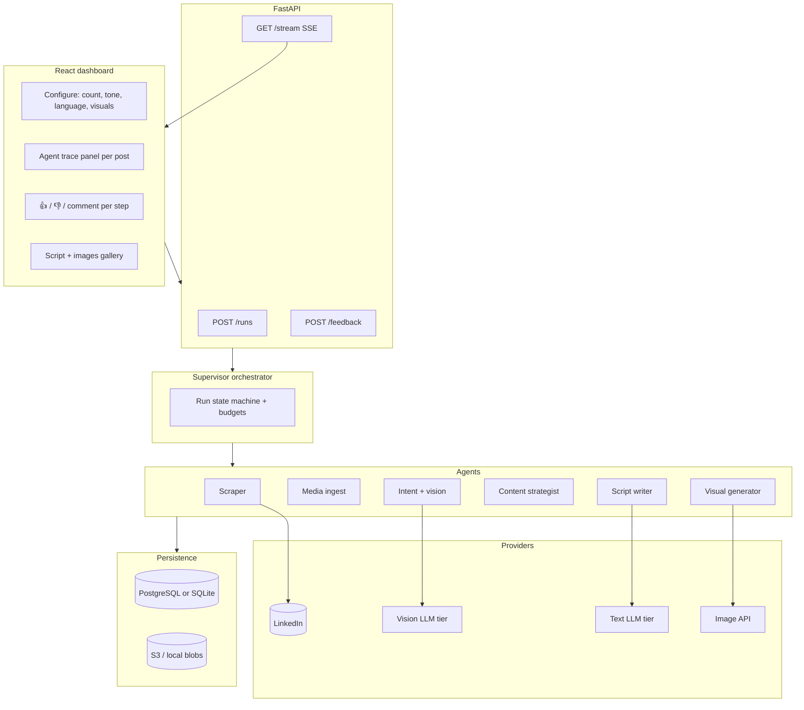

# Reelify — Agentic platform roadmap

**Status:** v1 foundation shipped (branch `feature/product-roadmap-and-polish`)  
**Goal:** Evolve from *scrape → single LLM call* into an **observable multi-agent pipeline** that understands posts (including images/carousels), writes high-engagement scripts in **English / Gujarati / Hindi**, optionally generates **visual assets**, and lets users **correct agent mistakes** — production-grade and **cost-aware**.

---

## 1. Current state vs target

| Today | Target |
|---|---|
| Scraper: text + URL only | Rich `Post` with media type, assets, carousel frames |
| One `content.py` LLM call | Staged agents: understand → plan → write → (optional) visualize |
| SSE events for progress | **Traceable steps** with reasoning summaries + artifacts + feedback |
| In-memory run cache | Durable runs, steps, costs, media in object storage |
| English-only scripts | User-selected `en` / `gu` / `hi` (+ tone) |
| No images | Optional thumbnail / slide images for social posts |

**Design principle:** Stay **framework-light** (no mandatory LangChain). Use a **supervisor orchestrator** + small single-purpose agents that emit typed events. Add LangGraph only if branching/retry graphs become unwieldy (>~8 conditional paths).

---

## 2. Target architecture



### 2.1 Agent responsibilities

| Agent | Input | Output | Model tier |
|---|---|---|---|
| **Scraper** | N saved posts | `Post` + `media_refs[]` | Playwright (no LLM) |
| **Media ingest** | `media_refs` | Local/S3 URIs, thumbnails, frame list | None / ffmpeg for video poster |
| **Intent** | text + images | `PostUnderstanding` (intent, audience, format, key claims) | **Cheap vision** first |
| **Strategist** | `PostUnderstanding` + user prefs | `ContentBrief` (angle, hook direction, CTA) | Small text LLM |
| **Writer** | brief + source | `ReelsScript` in chosen language | Sonnet (quality) |
| **Visual** (opt-in) | brief + script | 1–4 images (thumbnail, carousel slides) | Image model |

**Key rule:** Vision runs **only** when `post.has_media` or classifier confidence &lt; threshold on text-only. Carousels: cap frames (e.g. first 4 + last 1) to control cost.

### 2.2 Observable event contract (extend existing `AgentEvent`)

Every agent step emits:

```json
{
  "type": "agent_step",
  "agent": "intent",
  "message": "Classified post as thought-leadership carousel",
  "payload": {
    "run_id": "uuid",
    "post_index": 2,
    "step_id": "uuid",
    "step": "intent.analyze",
    "status": "completed",
    "duration_ms": 1240,
    "model": "gemini-2.0-flash",
    "cost_usd": 0.0021,
    "reasoning_public": "Carousel shows 5 slides; slide 2 has chart...",
    "artifacts": [
      { "kind": "json", "name": "post_understanding.json", "url": "/runs/.../artifact" }
    ],
    "input_summary": "text 412 chars, 5 images",
    "output_summary": "intent=educational, format=carousel"
  }
}
```

Frontend maps these to an **expandable timeline** (like Cursor agent steps). User feedback:

```json
POST /runs/{run_id}/posts/{post_index}/steps/{step_id}/feedback
{ "rating": "down", "comment": "Wrong language — post was Gujarati source" }
```

Store feedback for eval sets and future prompt fixes (not auto-retrain in v1).

---

## 3. Data models (new / extended)

```python
# models.py (conceptual)

class MediaAsset(BaseModel):
    kind: Literal["image", "carousel_slide", "video", "document"]
    url: str
    storage_path: str | None
    width: int | None
    height: int | None
    slide_index: int | None

class Post(BaseModel):
  # existing fields +
    post_type: Literal["text", "image", "carousel", "video", "mixed"]
    media: list[MediaAsset]
    language_detected: str | None  # iso 639-1

class PostUnderstanding(BaseModel):
    primary_intent: str  # e.g. educate, promote, story, hot_take
    audience: str
    content_format: str
    key_points: list[str]
    visual_summary: str | None  # from vision
    engagement_hooks: list[str]  # candidate angles
    confidence: float

class ContentBrief(BaseModel):
    angle: str
    hook_direction: str
    structure: list[str]  # beat outline
    cta_type: str

class ReelsScript(BaseModel):
  # existing +
    language: Literal["en", "gu", "hi"]
    brief_id: str

class GeneratedVisual(BaseModel):
    kind: Literal["thumbnail", "slide", "quote_card"]
    storage_path: str
    prompt_used: str
```

---

## 4. Vision & intent (requirement 1)

### 4.1 Scraper enhancements

- Detect post container type (single image, carousel dots, video player).
- Extract **high-res image URLs** (or screenshot carousel slides via Playwright if URLs are blob/CDN-tokenized).
- Store **per-slide order** for carousels.
- Emit `post_scraped` with `media` metadata.

### 4.2 Intent agent flow

1. **Text-only fast path** (Haiku / Flash): classify intent from `text_content` only. If confidence ≥ 0.85 and no media → skip vision.
2. **Vision path** (when media present or low confidence):
   - Batch images into **one** multimodal call per post (not per slide) when possible.
   - Prompt: extract slide text (OCR), chart/data claims, narrative arc, brand cues.
3. Output `PostUnderstanding` + public reasoning string.

### 4.3 Recommended vision stack (cost-optimized, May 2026)

Use a **tiered router** — default cheap, escalate on failure:

| Tier | Model | When | Rough economics |
|---|---|---|---|
| **T0** | Text-only classifier | No images | ~$0.0001/post |
| **T1** | **Gemini 2.0 Flash** (vision) | Carousels, charts, dense slides | Among lowest $/1M tokens + images |
| **T2** | **Claude Haiku 4.5** (vision) | T1 low confidence or complex layout | Still cheap vs Sonnet |
| **T3** | **Claude Sonnet** (vision) | User enables “high accuracy” or T2 fails | 10–20× T1; use sparingly |

**Implementation:** `providers/vision.py` with `analyze(images, text) -> PostUnderstanding` and per-run **budget cap** (e.g. max $0.05 vision per post).

**Carousel cap:** Max 5 images sent to VLM; downscale to 1024px long edge before upload.

---

## 5. Content generation (requirement 2)

### 5.1 Strategist → Writer split

- **Strategist** (small model): turns `PostUnderstanding` + tone + **language** into `ContentBrief`. Cheap, cacheable system prompt.
- **Writer** (Sonnet): produces final JSON `ReelsScript` with strict schema. Inject brief + original post + “write for maximum retention in first 3s”.

### 5.2 Multilingual (en / gu / hi)

| Concern | Approach |
|---|---|
| UI | Language dropdown in Configure panel (default `en`) |
| Prompts | Language-specific style guides (Devanagari/Gujarati script rules, code-mixing norms for Reels) |
| Detection | Intent agent sets `language_detected`; user can override |
| Quality | For `gu`/`hi`: optional second pass “native fluency polish” (Haiku) only if user enables |
| Output | Same JSON schema; frontend fonts must support Gujarati/Devanagari (Noto Sans Gujarati / Devanagari) |

**Cost tip:** One Sonnet call per post in target language — avoid translate-then-rewrite chains unless polish pass is on.

### 5.3 Engagement rubric (writer system prompt)

Explicit scoring targets in prompt (not a separate call unless “premium” mode):

- Hook: curiosity gap / pattern interrupt in ≤15 words  
- Script: one idea per beat, spoken rhythm, 30–60s  
- Caption: first line standalone value  
- CTA: single action  

Optional **premium:** small model returns `engagement_score` + one improvement tip (extra ~$0.001).

---

## 6. Thumbnails & images (requirement 3)

### 6.1 Visual agent (user opt-in per run)

Configure: `generate_visuals: false | thumbnail_only | full_pack`

| Asset | Use case | Model direction |
|---|---|---|
| **Thumbnail** | Reels cover / LinkedIn native | Flux Schnell or GPT Image Mini — fast/cheap |
| **Quote card** | Static post | Template + headline from hook (HTML/CSS) **or** image gen |
| **Carousel slides** | IG carousel from script beats | 3–5 images, shared style prompt |

**Cost controls:**

- Default **template-first** thumbnails (no gen API) — CSS + gradient + hook text (₹0).
- Image gen behind flag; max 4 images/run; fixed resolution 1024×1024.
- Store prompts + seeds for reproducibility.

### 6.2 Provider abstraction

```python
# providers/image.py
async def generate_thumbnail(brief: ContentBrief, script: ReelsScript, style: str) -> GeneratedVisual
```

Swap Fal / Replicate / OpenAI without touching agents.

---

## 7. Observability & feedback (requirement 4)

### 7.1 Trace UI (frontend)

Per post, vertical **agent timeline**:

- Step name, status, duration, model, cost  
- Expand: public reasoning (markdown), artifact links (JSON, images)  
- Actions: 👍 👎 + optional comment  

Global run summary: total cost, tokens, failures.

### 7.2 Backend

| Component | Purpose |
|---|---|
| `runs`, `run_steps`, `feedback` tables | Durability |
| `step_id` on every event | Correlate SSE ↔ DB |
| Redact PII in `reasoning_public` | Production safety |
| Admin view of negative feedback | Weekly prompt tuning |

### 7.3 Human-in-the-loop

| Checkpoint | Behavior |
|---|---|
| After intent | Optional “Approve understanding” before write (power users) |
| After script | Existing inline edit + regenerate |
| After visual | Pick 1 of 3 variants (if multi-gen enabled) |

Default: **autonomous** with full trace; checkpoints off for speed.

---

## 8. Production readiness

### 8.1 Infrastructure

| Layer | Recommendation |
|---|---|
| **API** | FastAPI + Uvicorn, health/readiness, graceful shutdown |
| **Jobs** | Move long runs off request thread: **ARQ** (Redis) or **Dramatiq** — keeps SSE via DB poll or Redis pub/sub |
| **DB** | PostgreSQL (prod), SQLite (local) via SQLAlchemy 2 |
| **Object storage** | S3-compatible (R2/MinIO local) for media + artifacts |
| **Secrets** | env + later Vault; never log cookies |
| **LinkedIn session** | Encrypted Playwright `storage_state` on disk |

### 8.2 Reliability

- Retries with exponential backoff (429/5xx) per provider  
- Idempotent `run_id` — safe to resume failed posts only  
- Circuit breaker if daily budget exceeded  
- Scraper: keep existing selector fallbacks + artifact dump  

### 8.3 Security & compliance

- Personal-use disclaimer; per-user LinkedIn credentials  
- Rate limits on `/runs` and image gen  
- Media retention TTL (e.g. 30 days)  
- No training on user content without opt-in  

### 8.4 Deploy shape (v1 prod)

```
Single VPS / Fly.io machine:
  - uvicorn (API + static frontend)
  - redis (queue)
  - worker process (orchestrator)
  - postgres + R2
```

Scale later: split worker pool when >50 concurrent runs.

---

## 9. Cost optimization playbook

### 9.1 Per-post cost model (typical run, 10 posts)

| Stage | Strategy | Est. cost |
|---|---|---|
| Scrape | No LLM | $0 |
| Intent (50% with images) | 5× Flash vision + 5× text-only | $0.02–0.08 |
| Strategist | 10× Haiku + prompt cache | $0.01–0.03 |
| Writer | 10× Sonnet + cache | $0.15–0.40 |
| Thumbnails (opt-in, 10) | Template $0 or 10× Flux Schnell | $0–0.20 |
| **Total** | | **~$0.20–0.70 / 10 posts** |

### 9.2 Rules engine (enforce in orchestrator)

```python
class RunBudget:
    max_usd: float = 2.0
    max_vision_calls: int = 20
    allow_sonnet_vision: bool = False
    max_images_per_post: int = 5
```

- Hard-stop run when budget exceeded; emit `run_budget_exceeded`.  
- Log `cost_usd` on every `agent_step`.  
- Dashboard shows **estimated cost** before Run (based on N, media %, visuals toggle).

### 9.3 Caching

| Cache | Key |
|---|---|
| Anthropic prompt cache | Strategist + writer system prompts (already used) |
| Vision | Hash(image bytes) → understanding (24h) |
| Writer | Hash(brief + language + tone) → script |

---

## 10. Implementation phases

### Phase 0 — Foundation (1–2 weeks) ✅ v1

- [x] `runs` / `run_steps` / `feedback` schema (SQLite in `data/reelify.db`)  
- [x] `agent_step` SSE events + persistence  
- [x] Orchestrator stages: scrape → **analyze** → generate  
- [x] Provider wrapper `providers/llm.py` + cost estimates  
- [x] Run budget (`REELIFY_MAX_RUN_BUDGET_USD`, default $2)  

**Exit:** Every agent emits trace steps; runs survive restart.

### Phase 1 — Rich scrape + intent (2–3 weeks) — partial ✅

- [x] Scraper: media type + image URL detection  
- [ ] Media ingest agent (download + resize to object storage)  
- [x] Intent agent (Haiku, text + media metadata; **no vision API yet**)  
- [x] UI: Agent trace panel + 👍/👎 feedback  

**Exit:** Carousel posts get `PostUnderstanding` in trace (vision upgrade next).

### Phase 2 — Strategist + multilingual writer (1–2 weeks) ✅ v1

- [x] Language selector (en / gu / hi) end-to-end  
- [x] Strategist (Haiku) + Writer (Sonnet) with brief in context  
- [x] Engagement-focused writer prompts  
- [x] Reasoning visible in Agent trace  

**Exit:** User gets Gujarati/Hindi scripts with visible agent reasoning.

### Phase 3 — Observability + feedback (1 week)

- [ ] Feedback API + DB  
- [ ] UI: thumbs + comment on each step  
- [ ] Export run trace as JSON/Markdown  

**Exit:** User can flag wrong intent; team can review weekly.

### Phase 4 — Visual generation (2 weeks)

- [ ] Template thumbnails (free path)  
- [ ] Image provider integration (opt-in)  
- [ ] UI: asset gallery + download  
- [ ] Per-run visual budget  

**Exit:** Optional thumbnail pack for social posting.

### Phase 5 — Production hardening (2–3 weeks)

- [ ] ARQ worker + Redis; SSE from step persistence  
- [ ] Playwright session persistence  
- [ ] Integration tests + eval set (20 golden posts)  
- [ ] Monitoring (Sentry, cost alerts)  
- [ ] Deploy docs + backup strategy  

**Exit:** Safe to run daily for real users.

---

## 11. Suggested repo layout (target)

```
agents/
  scraper.py
  media_ingest.py
  intent.py
  strategist.py
  writer.py
  visual.py
orchestrator/
  supervisor.py
  state_machine.py
  budgets.py
providers/
  llm_anthropic.py
  vision_gemini.py      # primary cheap vision
  vision_anthropic.py   # fallback
  image_fal.py
models/
  post.py
  understanding.py
  events.py
db/
  models.py
  repo.py
api/
  runs.py
  feedback.py
  stream.py
```

Keep `events.py` EventHub for SSE; workers write steps to DB **and** push to hub.

---

## 12. Risks & mitigations

| Risk | Mitigation |
|---|---|
| LinkedIn blocks scraping / media URLs expire | Session persistence; download media immediately; user-agent rotation |
| Vision misreads Gujarati in images | Language override; T2 fallback; user feedback |
| Runaway API costs | Per-run budget; vision only when needed; caps on images |
| “Agentic” complexity | Max 6 agents; no open-ended tool loops in v1 |
| Image gen quality | Template default; gen as premium |

---

## 13. Success metrics

| Metric | Target |
|---|---|
| Intent accuracy (human-rated sample) | ≥ 80% on 50-post eval set |
| User copies/exports script | ≥ 1 per run (existing product metric) |
| Negative feedback rate | &lt; 15% of steps |
| P95 run time (10 posts, no visuals) | &lt; 3 min |
| Avg cost per post (no visuals) | &lt; $0.06 |
| Uptime | 99% (prod) |

---

## 14. What NOT to build in v1

- Autonomous posting to Instagram/LinkedIn  
- Arbitrary tool-use agents (web search, email, etc.)  
- Fine-tuning custom models on user data  
- Real-time collaborative editing  
- Full LangGraph unless supervisor becomes unmaintainable  

---

## 15. Immediate next steps (this week)

1. Review and approve phase order + vision provider choice (recommend **Gemini 2.0 Flash** as T1).  
2. Implement Phase 0: `run_steps` table + `agent_step` events (backend only).  
3. Spike: scrape one carousel post → extract 3 images → single Flash vision call → JSON understanding.  
4. Add `language` to `RunRequest` + UI dropdown (wire to writer only at first).  

---

*This document supersedes the “Tier B” items in `PRODUCT_ROADMAP.md` for agentic work; keep both in sync as phases ship.*
