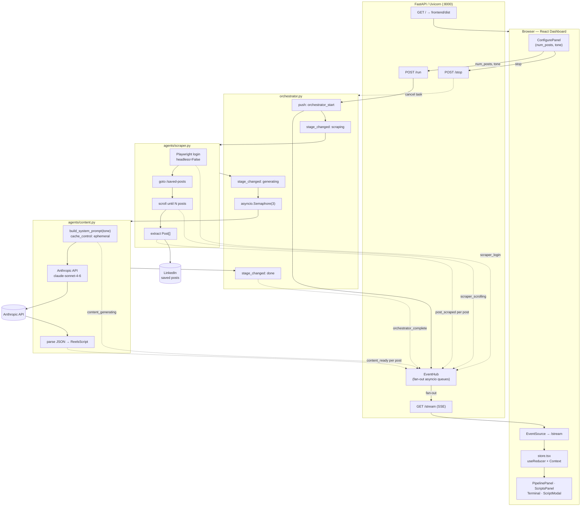

# Reelify — Architecture & Tech Stack

A short reference of what powers the LinkedIn → Instagram Reels script pipeline, and why each piece is shaped the way it is.

---

## 1. Tech Stack

### Backend (Python)

| Layer | Tool | Why |
|---|---|---|
| Web server | **FastAPI** + **Uvicorn** | ASGI-native; easy SSE + JSON endpoints in one app |
| Browser automation | **Playwright** (async, Chromium) | Real browser needed because LinkedIn renders posts client-side and requires login |
| LLM client | **anthropic** (`AsyncAnthropic`) | Generates Reels scripts via `claude-sonnet-4-6` |
| Real-time stream | **sse-starlette** (SSE) | Server-Sent Events for one-way push of pipeline events |
| Data models | **pydantic** v2 | `Post`, `ReelsScript`, `AgentEvent`, request validation |
| Config | **python-dotenv** | Loads `ANTHROPIC_API_KEY`, `LINKEDIN_EMAIL`, `LINKEDIN_PASSWORD` |
| Tests | **pytest**, **pytest-asyncio**, **httpx** | Async-friendly test runner + HTTP client |

### Frontend (TypeScript / React)

| Layer | Tool | Why |
|---|---|---|
| Framework | **React 18** | Component model for the live dashboard |
| Language | **TypeScript 5** | Static types over event payloads + script models |
| Build / dev server | **Vite 5** + `@vitejs/plugin-react` | Fast HMR, ESM-native, simple production bundle to `frontend/dist/` |
| Styling | **CSS Modules** (`*.module.css`) + **OKLCH** color tokens (`styles/tokens.css`) | Scoped class names; modern perceptual color |
| State | **`useReducer` + Context** (`state/store.tsx`) | Single store with one reducer — no Redux/Zustand needed for this size |
| Live data | **`EventSource`** (browser SSE) | Subscribes to `/stream`, dispatches events into the reducer |
| Animations | Hand-rolled hooks (`usePipelineEngine`, `useElapsed`, `useReducedMotion`) + CSS | Comet/hex/scope visuals run on `requestAnimationFrame` |

### Hosting topology

- **Dev:** Vite dev server on `:5173`, FastAPI on `:8000`. Frontend uses relative paths (`/run`, `/stream`), so during dev the vite config proxies them through.
- **Prod:** `npm run build` emits `frontend/dist/`, and FastAPI serves it directly — `main.py` mounts `dist/assets` and returns `dist/index.html` on `/`. Same-origin, no CORS needed.

---

## 2. The "Agents"

The word *agent* here is a **domain term**, not a framework. There is no LangChain, LangGraph, Anthropic Managed Agents, OpenAI Assistants, or autonomous tool-using loop. Each "agent" is a plain Python module under `agents/` that owns one stage of the pipeline and emits events to the shared bus.

### Where they live

```
agents/
├── __init__.py
├── scraper.py    # stage 1 — pulls saved LinkedIn posts
└── content.py    # stage 2 — generates a Reels script per post
```

### `agents/scraper.py` — the Scraper Agent

- **What it does:** logs into LinkedIn, navigates to `/my-items/saved-posts/`, scrolls until *N* posts are loaded, then extracts `author`, `text_content`, and `post_url` from each `<li>`.
- **Implementation:** pure Playwright. No AI involved.
- **Origin:** custom code in this repo. Selectors anchor on stable ARIA roles + scaffold classes because LinkedIn hashes its CSS class names per deploy. Falls back to dumping candidate selector counts + a screenshot + the `<main>` HTML when the page shape changes (e.g. `linkedin_saved_posts_debug.png`).
- **Login UX:** runs `headless=False, slow_mo=50` so the user can complete 2FA / CAPTCHA / "checkpoint" challenges in the visible Chromium window (up to 5 minutes).
- **Output:** `list[Post]`, plus emits `scraper_login`, `scraper_scrolling`, `post_scraped`, `scraper_done` events.

### `agents/content.py` — the Content Agent

- **What it does:** for each scraped post, calls Claude with a tone-conditioned system prompt and parses the JSON response into a `ReelsScript` (`hook`, `script`, `caption`, `hashtags`, `cta`).
- **Implementation:** single `messages.create` call per post using `anthropic.AsyncAnthropic`.
- **Model:** `claude-sonnet-4-6`, `max_tokens=1024`.
- **Prompt caching:** the system prompt is sent with `cache_control: { type: "ephemeral" }`. Across the N posts of a single run, the per-post system tokens hit cache after the first call → meaningful cost savings on bigger runs.
- **Tone guide:** four canonical tones (`Punchy`, `Story-led`, `Analytical`, `Educational`) defined in `TONE_GUIDE`. Unknown tones fall back to `Punchy`.
- **Origin:** custom code in this repo.
- **Output:** `ReelsScript | None` (returns `None` on parse/API failure, emits `content_error`), plus emits `content_generating` and `content_ready` events.

### `orchestrator.py` — the Orchestrator

Not under `agents/`, but conceptually a third agent. Sequences the stages:

1. Emit `orchestrator_start` + `stage_changed: scraping`.
2. Run the scraper. On failure, emit `error` + `stage_changed: idle` and stop.
3. Emit `stage_changed: generating`.
4. Run the content agent for every post **in parallel** behind an `asyncio.Semaphore(3)` — at most 3 concurrent Anthropic calls.
5. Emit `stage_changed: done` + `orchestrator_complete`.

---

## 3. Architectural Decisions

These are the non-obvious calls — why the code looks the way it does.

### 3.1 Event-driven pipeline over polling

Backend stages push typed events (`AgentEvent`) into a shared **`EventHub`** (`events.py`). The `/stream` SSE endpoint forwards them to the browser. The frontend reducer mutates state in response. No polling, no DB, no message broker — pure in-process pub/sub.

### 3.2 EventHub fans out, one bounded queue per subscriber

A single `asyncio.Queue` can't fan out — `get()` removes the event. So `EventHub.subscribe()` hands every consumer its own `asyncio.Queue(maxsize=200)`. When a queue is full, the oldest event is dropped (`get_nowait`) instead of blocking the producer. This lets multiple tabs (or the Vite dev server + the FastAPI-served bundle) watch the same run without one slow consumer stalling the rest.

### 3.3 Concurrency: serial scrape, parallel generate

- **Scraping** is serial because there is one browser context, one logged-in session, and LinkedIn's UI is stateful (scroll position, lazy-load).
- **Script generation** is `asyncio.gather` behind `Semaphore(3)`. Three parallel Anthropic calls is the sweet spot: enough to keep the user's wait short, low enough to avoid rate-limit churn.

### 3.4 One pipeline at a time

`main.py` tracks `_current_task: asyncio.Task | None`. A second `POST /run` while a task is live returns **HTTP 409 `already_running`**. `POST /stop` calls `task.cancel()`, the orchestrator catches `CancelledError`, emits `stage_changed: idle`, then re-raises. Keeps the in-memory model honest.

### 3.5 Visible browser for login

`headless=False` is deliberate. LinkedIn frequently routes new logins through `/checkpoint` or `/challenge` (CAPTCHA, email code, app push). The user sees the Chromium window and solves it in-band; the scraper polls the URL for up to 5 minutes before giving up.

### 3.6 Defensive scraping

LinkedIn changes its DOM regularly. Mitigations:

- **`:visible` filter** on the login inputs — the redesigned login page has hidden autofill duplicates; without `:visible`, `wait_for_selector` locks onto a hidden one.
- **`press("Enter")` over `click("button[type=submit]")`** — `click` has an actionability-retry loop that can re-resolve to an unrelated button after navigation.
- **Multiple candidate post selectors** probed on failure, plus a full-page screenshot + `<main>` HTML dump — gives us evidence to update selectors next time the layout shifts.

### 3.7 Prompt caching as cost lever

The Reels-scriptwriter system prompt is identical across the N posts of a run. Marking it `cache_control: ephemeral` means Anthropic caches the prompt tokens for ~5 minutes, so posts 2..N pay the cached read rate, not the full input rate.

### 3.8 Frontend state — `useReducer` + Context, not Redux

State is bounded (one in-flight run, ≤50 scripts, ≤200 log lines, ≤6 in-view posts). One reducer in `state/store.tsx` handles every event type, every UI action, and the comet engine ticks. A Context provider exposes `{ state, dispatch }`. No need for a state library.

### 3.9 Decoupled "comet" animation engine

`usePipelineEngine` runs `requestAnimationFrame` and dispatches `COMET_FRAME` actions with which comets advanced and which landed. Scripts arriving from the backend are **buffered** in `pendingScripts` until their corresponding comet lands — that's why a freshly generated script doesn't pop into the right column instantly; it waits for the visual to catch up. The reducer holds the seam in one place (`commitScript`).

### 3.10 SSE over WebSocket

The data only ever flows server → client (commands go through `POST /run` and `POST /stop`). SSE is HTTP-native, survives reverse proxies cleanly, and reconnects automatically in the browser — no need for the bidirectional plumbing of WebSocket.

### 3.11 Same-origin in production

`main.py` mounts the built React bundle at `/`. So the production app and its API share an origin — no CORS config, no separate static host, one `uvicorn` process to deploy.

---

## 4. End-to-End Flow



### Event vocabulary (over SSE)

| `type` | Emitter | Carries |
|---|---|---|
| `orchestrator_start` | orchestrator | `num_posts`, `tone` |
| `stage_changed` | orchestrator | `stage`: `scraping` \| `generating` \| `done` \| `idle` |
| `scraper_login` / `scraper_verification` / `scraper_navigating` / `scraper_scrolling` | scraper | progress messages |
| `post_scraped` | scraper | `index`, `total`, `post` |
| `scraper_done` | scraper | `count` |
| `content_generating` | content | `post_index`, `tone` |
| `content_ready` | content | `post_index`, `script` |
| `content_error` | content | `post_index`, `post_url` |
| `orchestrator_complete` | orchestrator | `posts_scraped`, `scripts_generated`, `errors` |
| `error` | any | message + payload |
