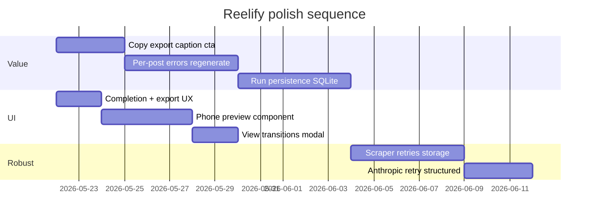

# Reelify — Product roadmap

Branch: `feature/product-roadmap-and-polish`

This doc is the north star for turning the pipeline demo into a **robust, valuable product** with a **polished, animated UI**.

---

## Where you are today

| Strength | Gap |
|---|---|
| Real LinkedIn scrape → Claude scripts | No persistence — refresh loses everything |
| Cinematic pipeline (comets, hex, scope) | Backend emits `caption` + `cta` but UI hid them |
| SSE live updates, stop/cancel | Scraper breaks when LinkedIn changes DOM |
| Tone + concurrency tuned | No “ship to Instagram” workflow (copy, export, edit) |
| `prefers-reduced-motion` hooks | v2 plan pieces missing (phone preview, kinetic titles) |

---

## 1. Robustness (trust the run)

### Backend

1. **Scraper resilience**
   - Version selectors in `config.py` or JSON so you can hotfix without redeploying logic.
   - Retry scroll/extract with exponential backoff (max 3) before failing the run.
   - Persist debug artifacts (`linkedin_saved_posts_debug.png`, HTML snippet) to `~/.reelify/debug/` with run id.

2. **Content agent**
   - Retry Anthropic on 429/5xx with jitter (tenacity or manual loop).
   - Structured output: use tool/schema or `response_format` when available; today JSON parse failures silently drop a post.
   - Include `post` snapshot on every `content_ready` event (author, `post_url`) so the UI never orphans scripts.

3. **Pipeline ops**
   - Run history: SQLite or JSON lines under `~/.reelify/runs/` — inputs, outputs, timestamps, error counts.
   - Health: `GET /health` (env ok, playwright installed, dist built).
   - Graceful shutdown: on SIGTERM, cancel task and emit `stage_changed: idle`.

4. **Auth/session**
   - Optional Playwright `storage_state` path — login once, reuse cookies for N days.
   - Surface “session expired” in UI when scraper hits login wall mid-run.

### Frontend

1. **SSE reliability** — reconnect with backoff; show “Reconnecting…” pill; on `orchestrator_complete` while disconnected, fetch `GET /runs/latest` (when backend has persistence).
2. **409 handling** — if `/run` returns `already_running`, offer “Watch current run” instead of silent failure.
3. **Error surfacing** — per-post failed cards in Scripts panel (from `content_error`), not only terminal lines.

---

## 2. Actual product value (why someone opens this daily)

Prioritize outcomes creators care about: **less blank-page time, more posted reels.**

### Tier A — ship this week (implemented on this branch)

- [x] **Full script detail** — hook, body, caption, CTA, hashtags, link to source post
- [x] **One-click copy** — “Copy for Instagram” (caption + hashtags + CTA) and “Copy teleprompter” (hook + script)
- [x] **Export run** — download all scripts as `.md` or `.json`

### Tier B — next 2 weeks

| Feature | Value |
|---|---|
| **Inline edit** | Done — edit in script modal, Save / Revert, `edited` badge on cards |
| **Regenerate one** | Done — `POST /regenerate/{post_index}` uses cached scrape, no re-scrape |
| **Quality score** | LLM rubric: hook strength, pacing, CTA clarity (1–5 + one tip) |
| **Batch tone compare** | Same post → 2 tones side-by-side |
| **Teleprompter mode** | Full-screen scroll at WPM, large type, green accent |

### Tier C — moat

- Schedule reminders (local notifications / calendar export)
- Optional Remotion preview from script scenes
- Notion/Google Docs export
- Multi-account LinkedIn profiles (separate `storage_state`)

---

## 3. UI & animations (feel premium, stay fast)

### Animation stack (recommended)

| Approach | When |
|---|---|
| **CSS** + `requestAnimationFrame` (current) | Pipeline canvas, comets, particles — keep |
| **View Transitions API** | Script card → modal morph (Chrome; progressive enhancement) |
| **Motion One** (~3kb) or **Framer Motion** | Modal, list stagger, completion confetti — pick one library, not both |

Avoid animating layout-heavy properties (`width`, `top`) on large lists; prefer `transform` + `opacity`.

### High-impact UI moves

1. **Phone preview** (from v2 handoff) — 9:16 frame with hook overlay + scene dots; updates when selecting a script.
2. **Completion moment** — when `stage === done'`: brief success pulse on scope core + “N scripts ready” with Export + Copy all.
3. **Script card micro-interactions** — staggered `animation-delay`, hover lift, active glow (partially there).
4. **Modal** — enter/exit spring, focus trap, copy toast with checkmark animation.
5. **Empty states** — illustrated idle pipeline (“Save posts on LinkedIn, run here”).
6. **Run progress** — determinate bar: `scraped / total` + `scripts / total` dual metrics in header.

### Accessibility (non-negotiable)

- All motion behind `useReducedMotion()` (already started).
- `aria-live="polite"` on script count and stage changes.
- Keyboard: `j/k` between scripts, `Enter` open, `Esc` close, `c` copy.

### Design system hygiene

- Tokens in `tokens.css` — add semantic tokens: `--success`, `--warn`, `--surface-elevated`.
- One icon set (current inline SVGs are fine until ~20 icons, then Lucide).

---

## 4. Suggested implementation order



---

## 5. Dev workflow on this branch

```bash
git checkout feature/product-roadmap-and-polish

# Terminal 1 — API
python main.py

# Terminal 2 — UI with HMR
cd frontend && npm run dev
# open http://localhost:5173
```

After UI changes: `cd frontend && npm run build` before shipping single-process prod.

---

## 6. Success metrics

Track locally first (no analytics SDK required):

- **Run completion rate** — `orchestrator_complete` / `orchestrator_start`
- **Scripts per run** — `scripts_generated / num_posts`
- **Time to first script** — ms from start → first `content_ready`
- **Copy/export actions** — increment in frontend (later: POST `/telemetry` if you want)

A product is “working” when users finish a run and **copy or export at least one script** — not when the comet animation finishes.
